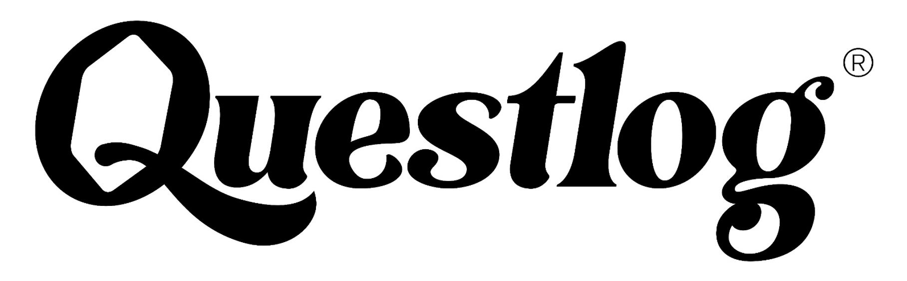

<div id="top"></div>
<!--
*** Thanks for checking out the Best-README-Template. If you have a suggestion
*** that would make this better, please fork the repo and create a pull request
*** or simply open an issue with the tag "enhancement".
*** Don't forget to give the project a star!
*** Thanks again! Now go create something AMAZING! :D
-->


<!-- PROJECT SHIELDS -->
<!--
*** I'm using markdown "reference style" links for readability.
*** Reference links are enclosed in brackets [ ] instead of parentheses ( ).
*** See the bottom of this document for the declaration of the reference variables
*** for contributors-url, forks-url, etc. This is an optional, concise syntax you may use.
*** https://www.markdownguide.org/basic-syntax/#reference-style-links


<!-- PROJECT LOGO -->
<br />
<div align="center">
    <div align="center>

<a href="www.questlog.eu">
    
  </a>
</div>

<h1 align="center">Matrix-Configurator</h1>


</div>
<br>


<!-- TABLE OF CONTENTS -->
<details>
  <summary>Table of Contents</summary>
  <ol>
    <li>
      <a href="#about-the-project">About The Project</a>
      <ul>
        <li><a href="#built-with">Built With</a></li>
      </ul>
    </li>
    <li>
      <a href="#getting-started">Getting Started</a>
    </li>
    <li><a href="#usage">Usage</a></li>
  </ol>
</details>


<!-- ABOUT THE PROJECT -->
## About The Project

<br>


The Questlog Matrix Configurator is a browser tool, which increases the level of automization, standardization and quality assurance in the production process by:
* Providing an interactive React-based UI that allows the laser-cutter specialist to arrange country silhouettes based on demand
* Allowing the user to define country-specific offsets to ensure exact configuration across time
* Delivering a SVG Matrix on-click that can be consumed seamlessly by the laser-cutter software

<p align="right">(<a href="#top">back to top</a>)</p>

### Built With

* [React.js](https://reactjs.org/)
* [Node.js](https://nodejs.dev/)
* [Express](https://expressjs.com/)

<p align="right">(<a href="#top">back to top</a>)</p>


<!-- GETTING STARTED -->
## Getting Started

1. Clone the repo
   ```sh
   git clone https://github.com/DerWaldie/questlog-matrix-configurator.git
   ```
2. Open Powershell as Adminstrator and navigate to the repository root folder
3. Run setup.sh
  ```sh
    ./setup.sh
    ```

<p align="right">(<a href="#top">back to top</a>)</p>


<!-- USAGE EXAMPLES -->
## Usage

1. Save country silhouette SVGs in folder /server/img/countries and name them according to the country's name
2. To start Matrix-Configurator on an Apple or Linux OS navigate to the project folder and enter
```sh
 npm run dev
   ```
On a Windows OS enter 
```sh
 start npm start & cd frontend & npm start
   ```
A browser window with the Matrix-Configurator UI will start automatically.

3. Select the country silhouette for each matrix grid in dropdown menu
4. If default position of a specific country needs to be changed, navigate to frontend/src/config and adjust x and y offset for country. Offset is be 0 for x and y by default.
5. Once finished, hit the save button.
6. In the folder server/img/matrix you will find the laser-cutter-ready SVG with an unique ID. 

<p align="right">(<a href="#top">back to top</a>)</p>


